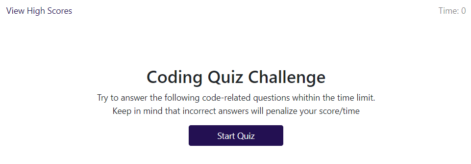
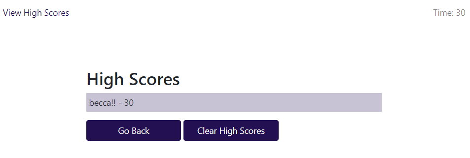
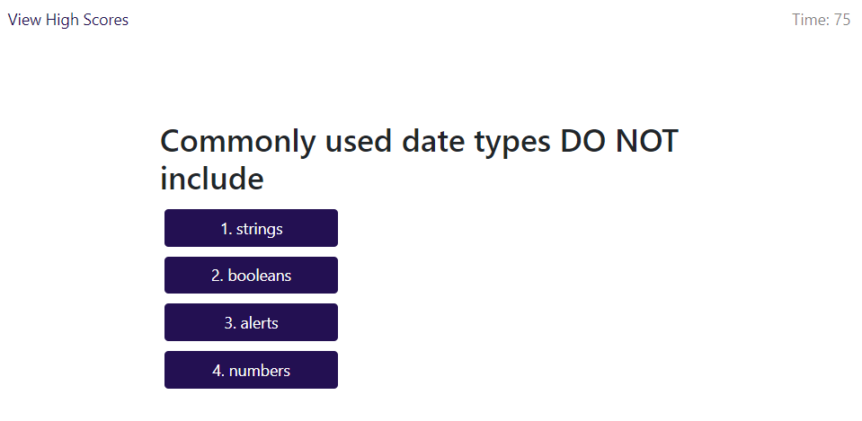

# code-quiz

This is a coding quiz! 

There are 5 questions in the quiz and there is 75 seconds to complete it.

If you get an answer incorrect, the timer will subtract 20s!!!

In the end, your final score will be how much time was remaining upon completion

Then you can be shown the final high scores as well as clear them out

This is what the main page looks like

This is what the main page looks like

This is what the questions page looks like

A link to the deployed application is found here: https://beccadoan.github.io/code-quiz/

